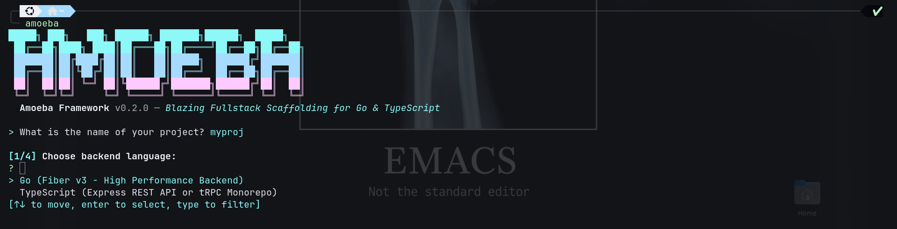

# ⚡ Amoeba Proteus (v0.2.2)

A high-performance, opinionated full-stack framework and CLI pairing systems speed with modern frontend and backend architectures.



## 🧬 CLI Capabilities & Matrix

The **Amoeba Proteus CLI** is built in native **Rust** for near-zero startup latency, automatic dependency management, and compile-time type safety.

```
amoeba new [PROJECT_NAME]
│
├── [1] Backend Language
│   ├── Go (Fiber v3)
│   │   ├── Database: PostgreSQL (GORM) | MongoDB (Go Driver v2)
│   │   └── Frontend: Next.js 15 | React (Vite) | Tauri 2.0 | API Only
│   │
│   └── TypeScript
│       ├── [2] Architecture Style
│       │   ├── Standard REST API (Modular Express)
│       │   │   ├── Database: PostgreSQL (Drizzle ORM) | MongoDB (Mongoose)
│       │   │   ├── Utils: BaseDto, ApiError (dataAlreadyExists), ApiResponse
│       │   │   └── Frontend: Next.js 15 | React (Vite) | Tauri 2.0 | API Only
│       │   │
│       │   └── tRPC Monorepo (Turborepo + pnpm workspace)
│       │       └── Frontend Apps: Web App | Tauri Desktop App | Both
```

## ⚡ Commands

### 1. Scaffold a New Project
```bash
amoeba new
# or with flags
amoeba new my-app --lang ts --arch trpc --monorepo-fe both
amoeba new my-rest --lang ts --arch rest --db drizzle --frontend react
amoeba new my-go --lang go --db gorm --frontend nextjs
```

### 2. Start Services (`amoeba start` / `amoeba dev`)
Run backend API server and frontend development environments simultaneously or individually:
```bash
# Start all project services concurrently (API + Frontend) with unified logs
amoeba start

# Start only the API backend
amoeba start --only-api

# Start only the frontend application (web / desktop)
amoeba start --only-frontend

# Run in production mode
amoeba start --prod
```

### 3. Build Services (`amoeba build`)
Compile binary servers and generate production frontend bundles:
```bash
# Build all project services (Go binary / TS API / Vite / Next.js)
amoeba build

# Build only the backend API service
amoeba build --only-api

# Build only the frontend application
amoeba build --only-frontend
```

### 4. Database Management (`amoeba db`)
Manage database schemas, generate migrations, and open studio interfaces:
```bash
# Generate database schema migrations / type artifacts
amoeba db generate

# Execute and apply pending database migrations
amoeba db migrate

# Open database studio GUI (e.g. Drizzle Studio)
amoeba db studio
```

### 5. Scaffold a Workspace Package (tRPC Monorepo Exclusive)
Inside any Amoeba tRPC monorepo:
```bash
amoeba new pkg <pkg_name>
```
*Creates `@repo/<pkg_name>` in `packages/<pkg_name>` with workspace configs and TypeScript definitions.*

### 6. Check for Updates
```bash
amoeba update
```

## 🛠️ CLI Development & Building
```bash
cd apps/cli
cargo build --release
```
The binary will be generated at `apps/cli/target/release/amoeba`.
